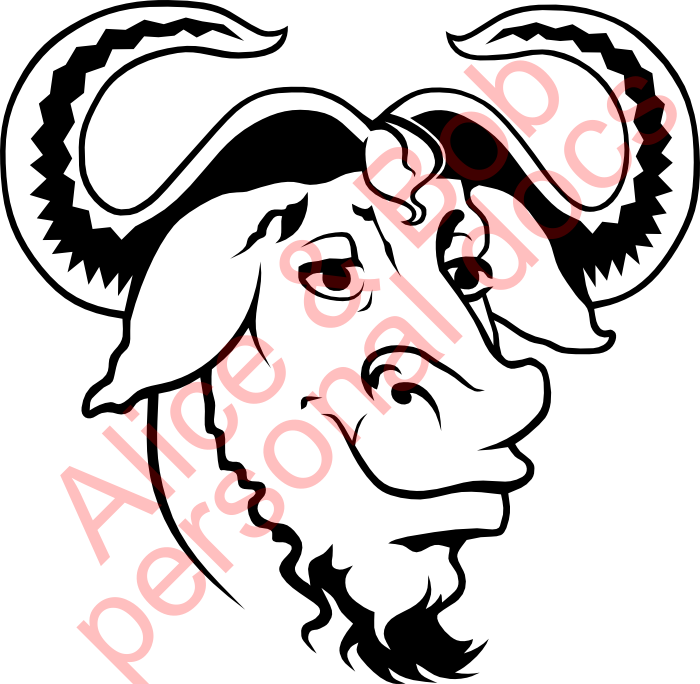
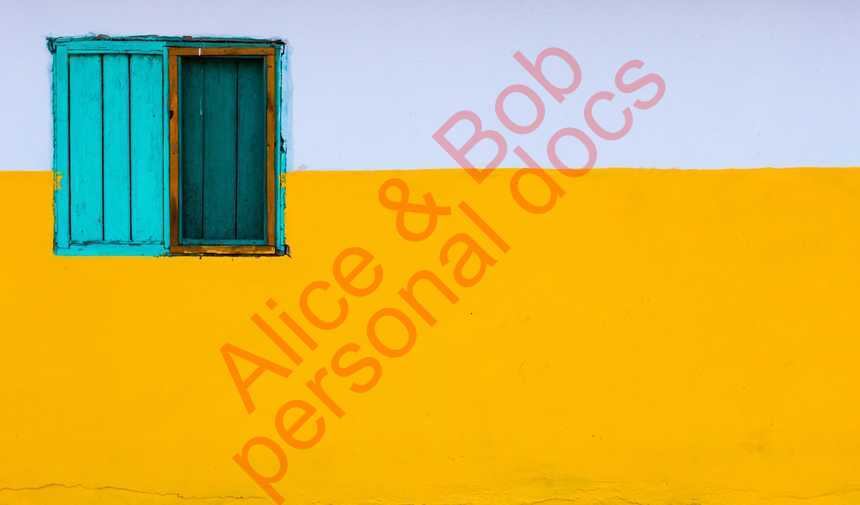

# Sensitive

## Details

Script to mark documents with personal data, so they can't be easily used for identity theft.
It adopts text size to picture height.

## Requirements

* bash (Linux or on Windows via git-bash or similar)
* [ImageMagick](https://imagemagick.org/)

## Usage 

Script requires 2 arguments:
* 1st - path to image, e.g. `"imgs\docs\personal.png`"
* 2nd - your note e.g. `"Alice & Bob"`

So your typical script call could look like:

```
sensitive "imgs\docs\personal.png" "Alice & Bob"
```

As result it will produce file `imgs\docs\personal_stamped.png` with red diagonal text over it `Alice & Bob personal docs`, e.g.:






